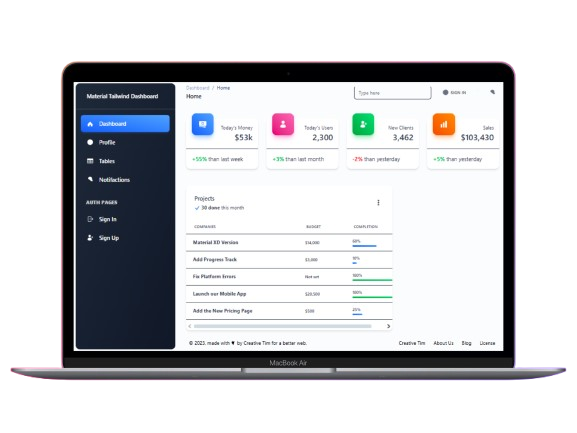

# Menu Dashboard

Dashboard administrativo moderno con menú lateral responsivo desarrollado con Angular y Tailwind CSS.

## Tabla de Contenidos

- [Características](#características)
- [Capturas de Pantalla](#capturas-de-pantalla)
- [Tecnologías](#tecnologías)
- [Requisitos Previos](#requisitos-previos)
- [Instalación](#instalación)
- [Configuración](#configuración)
- [Estructura del Proyecto](#estructura-del-proyecto)
- [Funcionalidades](#funcionalidades)
- [Agradecimientos](#agradecimientos)

## Características

- 🎨 Interfaz de dashboard moderna y atractiva
- 📱 Diseño completamente responsivo para todos los dispositivos
- 🔄 Menú lateral colapsable
- 📊 Widgets y gráficos interactivos
- 🎯 Navegación intuitiva y estructura organizada
- ⚡ Rendimiento optimizado con Angular
- 🔍 Sistema de búsqueda rápida
- 👤 Sección de perfil de usuario
- 📈 Visualización de estadísticas y métricas

## Capturas de Pantalla

### Dashboard Principal


### Vista Responsiva


## Tecnologías

- **Framework**: Angular 20.3.3
- **Lenguaje**: TypeScript
- **Estilos**: Tailwind CSS
- **Build Tool**: Angular CLI
- **Routing**: Angular Router

## Requisitos Previos

Antes de comenzar, asegúrate de tener instalado:

- [Node.js](https://nodejs.org/) (versión 18 o superior)
- [npm](https://www.npmjs.com/) (versión 9 o superior)
- [Angular CLI](https://angular.io/cli) (versión 20.3.3)
- [Git](https://git-scm.com/)

Para instalar Angular CLI globalmente:
```bash
npm install -g @angular/cli@20.3.3
```

## Instalación

Sigue estos pasos para instalar y ejecutar el proyecto localmente:

1. **Clona el repositorio**
```bash
git clone https://github.com/brayanhl17/menu-dashboard.git
```

2. **Navega al directorio del proyecto**
```bash
cd menu-dashboard
```

3. **Instala las dependencias**
```bash
npm install
```

4. **Inicia el servidor de desarrollo**
```bash
ng serve
```

5. **Abre tu navegador y accede a**
```
http://localhost:4200
```

La aplicación se recargará automáticamente cuando modifiques los archivos fuente.

## Configuración

### Comandos de Angular CLI

**Generar componentes, servicios y más:**
```bash
# Generar un componente
ng generate component component-name

# Generar un servicio
ng generate service service-name

# Generar un módulo
ng generate module module-name

# Ver lista completa de opciones
ng generate --help
```

**Build para producción:**
```bash
ng build
```
Los archivos compilados se generarán en el directorio `dist/`.

**Ejecutar pruebas:**
```bash
# Pruebas unitarias
ng test

# Pruebas end-to-end
ng e2e
```

## Estructura del Proyecto

```
menu-dashboard/
│
├── src/
│   ├── app/
│   │   ├── components/        # Componentes reutilizables
│   │   │   ├── sidebar/
│   │   │   ├── navbar/
│   │   │   ├── footer/
│   │   │   └── ...
│   │   │
│   │   ├── pages/            # Páginas/Vistas principales
│   │   │   ├── dashboard/
│   │   │   ├── profile/
│   │   │   ├── settings/
│   │   │   └── ...
│   │   │
│   │   ├── pipes/            # Pipes personalizados
│   │   │   └── ...
│   │   │
│   │   ├── app.component.ts  # Componente raíz
│   │   ├── app.component.html
│   │   ├── app.component.scss
│   │   ├── app.routes.ts     # Configuración de rutas
│   │   └── app.config.ts
│   │
│   ├── assets/               # Recursos estáticos
│   │   ├── images/
│   │   ├── icons/
│   │   └── ...
│   │
│   ├── environments/         # Variables de entorno
│   │   ├── environment.ts
│   │   └── environment.prod.ts
│   │
│   ├── styles.scss           # Estilos globales
│   ├── index.html            # HTML principal
│   └── main.ts               # Punto de entrada
│
├── angular.json              # Configuración de Angular
├── package.json              # Dependencias del proyecto
├── tsconfig.json             # Configuración de TypeScript
└── README.md                 # Este archivo
```

## Funcionalidades

### Menú Lateral (Sidebar)
- Items de menú con iconos personalizados
- Submenús desplegables multinivel
- Indicador de ruta activa
- Versión compacta para pantallas pequeñas
- Opción de anclaje/desanclaje del menú

### Dashboard Principal
- Vista general con métricas clave
- Widgets personalizables y reorganizables
- Gráficos y visualizaciones de datos
- Tarjetas informativas con estadísticas


### Características Adicionales
- Rutas protegidas con guards
- Lazy loading de módulos
- Interceptores HTTP
- Manejo de errores global
- Animaciones y transiciones suaves
- Optimización de rendimiento

## Agradecimientos

- A la comunidad de Angular por los recursos y componentes
- A Neiser Custodio - Canal de Youtube

---

Desarrollado por [Brayan](https://github.com/brayanhl17) | [Repositorio](https://github.com/brayanhl17/menu-dashboard)
